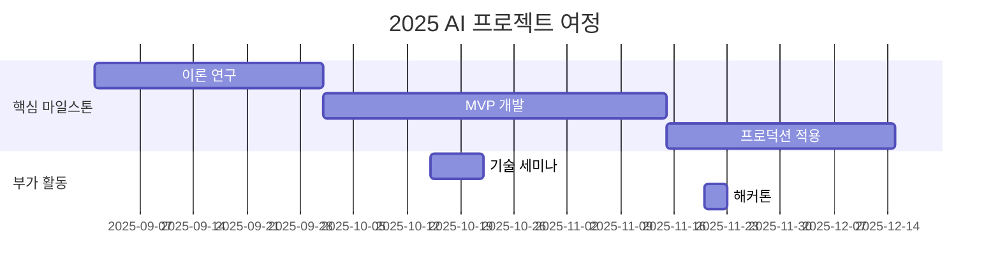

<h1 align="center"> Physical AI Lab </h1>

<div align="center">
<a href="https://pseudo-lab.com"></a>
<a href="https://discord.gg/EPurkHVtp2"></a>
<a href="https://github.com/Pseudo-Lab/PhyAI-Lab/stargazers"></a>
<a href="https://github.com/Pseudo-Lab/PhyAI-Lab/network/members"></a>
<a href="https://github.com/Pseudo-Lab/PhyAI-Lab/pulls"></a>
<a href="https://github.com/Pseudo-Lab/PhyAI-Lab/issues"></a>
<a href="https://github.com/Pseudo-Lab/PhyAI-Lab/graphs/contributors"></a>
</div>
<br>


<!-- sheilds: https://shields.io/ -->
<!-- hits badge: https://hits.seeyoufarm.com/ -->

<p align="center">
  
</p>


🚀 **Physical AI Lab에 오신 것을 환영합니다!**\
저희는 **`Imitation Learning, Vision-Language-Action(VLA), Robot Reasoning/Planning`** 등 Physical AI의 최신 연구 흐름을 탐구합니다.
논문 리뷰와 토론을 통해 트렌드를 이해하고, **`로봇과 시뮬레이터(SO-ARM 101/Isaac Sim)`**
를 활용한 실험을 통해 한계점과 개선 방향을 분석합니다.

우리의 목표는 로봇이 실생활에 도입될 수 있는 길을 여는 것입니다.
Physical AI를 더 똑똑하고, 더 강력하며, 더 실용적으로 만들기 위한 여정에 함께하세요!

## 🌟 프로젝트 목표 (Project Vision)
- **논문 리뷰 목표**
    - 매주 한 편의 논문을 리뷰하며 Physical AI의 발전방향에 대해 이해
    - Open question에 대해 토론하며 비판적으로 논문을 해석하고 더욱 깊게 이해하는 능력 함양
- **프로젝트 목표**
    - 최신 연구들의 한계점을 파악하고 이를 개선하기 위한 인사이트 도출
    - 예시
        - 모델의 성능을 어떻게 평가할 수 있으며 적절한 데이터셋을 어떻게 curation 할 수 있을까?
        - VLA의 장기 메모리 부족 문제를 어떻게 해결할 수 있을까?
        - Teleoperation만으로는 LLM처럼 internet-scale의 데이터를 수집하기 어려움을 어떻게 해결할 것인가?
- **최종 성과물**
    - 논문 리뷰 아카이브
    - 실험 결과 및 인사이트 정리 → 추후 연구주제 선정         |


## 🚀 프로젝트 로드맵 (Project Roadmap)



## 🛠️ 우리의 개발 문화 (Our Development Culture)
**우리의 개발 문화**  
```python
class CollaborationFramework:
    def __init__(self):
        self.tools = {
            'communication': 'Discord',
            'version_control': 'GitHub Projects',
            'ci/cd': 'GitHub Actions',
            'docs': 'Github Wiki'
        }
    
    def workflow(self):
        return """주간 사이클:
        1️⃣ 월요일: 스프린트 플래닝 (Notion 타임라인 공유)
        2️⃣ 수요일: 코드 리뷰 세션 (Live Share)
        3️⃣ 금요일: 데모데이 (실제 적용 사례 발표)"""
```


## 📈 성과 지표 (Achievement Metrics)
**2024 주요 KPI**  
| 지표                     | 목표치 | 현재 달성률 |
|--------------------------|--------|-------------|
| 커밋 수                  | 1,200  | 83%         |
| 이슈 해결률              | 95%    | 89%         | 
| 기술 블로그 게시물       | 24편   | 15편        |
| 오픈소스 기여도          | 8회    | 5회         |


## 💻 주차별 활동 (Activity History)

| 날짜 | 내용 | 발표자 | 
| -------- | -------- | ---- |
| 2025/02/ | OT       |      |
| 2025/02/ |  Part 1. | 미정 | 
| 2025/02/ |  Part 2. | 미정 | 
| 2025/02/ |  Part 3. | 미정 | 
| 2025/03/ |  Part 4. | 미정 | 
| 2025/03/ |  Part 5. | 미정 | 


## 💡 학습 자원 (Learning Resources)
**우리가 만든 지식 허브**  
- [AI Playbook](https://github.com/your-org/ai-playbook): 150+ 페이지의 실전 가이드
- [MLOps Pipeline Template](https://github.com/your-org/mlops-template): 재사용 가능한 인프라 코드
- [Failure Journal](https://your-org.github.io/failure-journal): 50+개의 실패 사례 분석 [31][34]


## 🌱 참여 안내 (How to Engage)
- 빌더로 참여 — 프로젝트 기획·운영 주도
- 러너로 참여 — 연구·개발·테스트 등 실행
- 청강 참여 — 공개 세션 참여 가능

❗️참여 링크: [가짜연구소 디스코드](https://discord.gg/EPurkHVtp2)
❗️커뮤니케이션 채널: 디스코드 #{{채널명}}

**누구나 청강을 통해 모임을 참여하실 수 있습니다.**  
1. 특별한 신청 없이 정기 모임 시간에 맞추어 디스코드 #Room-GH 채널로 입장
2. Magical Week 중 행사에 참가
3. Pseudo Lab 행사에서 만나기

## Acknowledgement 🙏

이 프로젝트는 가짜연구소 Open Academy로 진행됩니다.
여러분의 참여와 기여가 ‘우연한 혁명(Serendipity Revolution)’을 가능하게 합니다. 모두에게 깊은 감사를 전합니다.
OOO is developed as part of Pseudo-Lab's Open Research Initiative. Special thanks to our contributors and the open source community for their valuable insights and contributions.

## About Pseudo Lab 👋🏼</h2>

[Pseudo-Lab](https://pseudo-lab.com/) is a non-profit organization focused on advancing machine learning and AI technologies. Our core values of Sharing, Motivation, and Collaborative Joy drive us to create impactful open-source projects. With over 5k+ researchers, we are committed to advancing machine learning and AI technologies.

<h2>Contributors 😃</h2>
<a href="https://github.com/Pseudo-Lab/PhyAI-Lab/graphs/contributors">
  
</a>
<br><br>

<h2>License 🗞</h2>

This project is licensed under the [MIT License](https://opensource.org/licenses/MIT).

🚩 추가 팁 (Usage Tips)
- 각 항목 내 {{ }} 표시된 부분을 프로젝트에 맞게 꼭 수정하세요.
- 불필요한 프로젝트 유형 예시는 제거하거나 교체해 명확하게 하세요.
- 로드맵과 활동내역 부분에 Mermaid 다이어그램 등을 이용해 시각적으로 표현하는 것을 추천합니다.
- 체크박스(✅)와 표를 적절히 활용하면 진행 상황 한눈에 파악이 쉽습니다.
- ‘빌더’와 ‘러너’의 역할 분담과 상호 피드백 문화 강화에 README 내 문장으로 강조를 절대 잊지 마세요.
- README가 단순 안내서 이상으로 공동체 철학과 가치를 담는 협업 선언문임을 인지하고, 누구나 읽고 이해하기 쉽도록 간결 명료하게 작성하세요.
